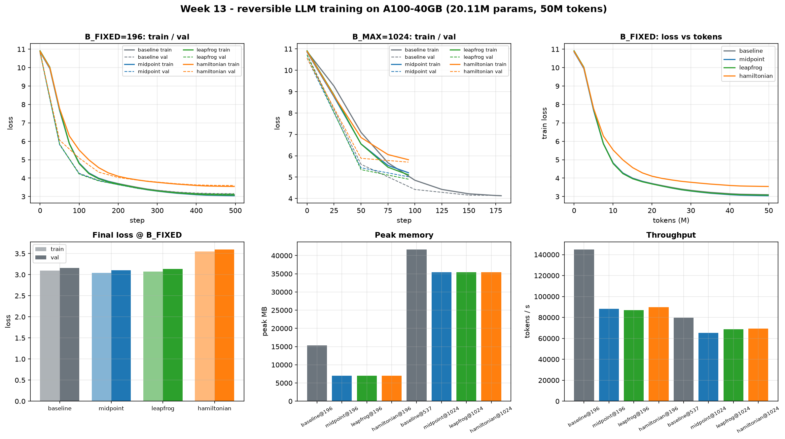
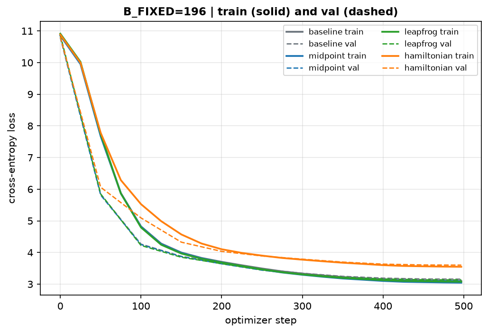
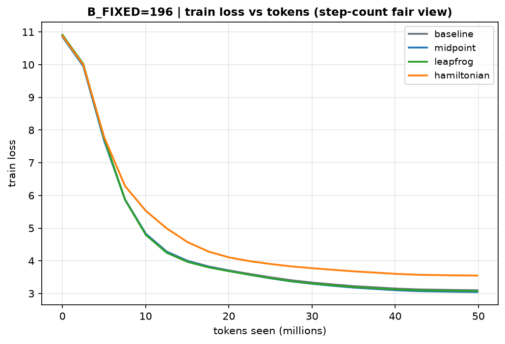
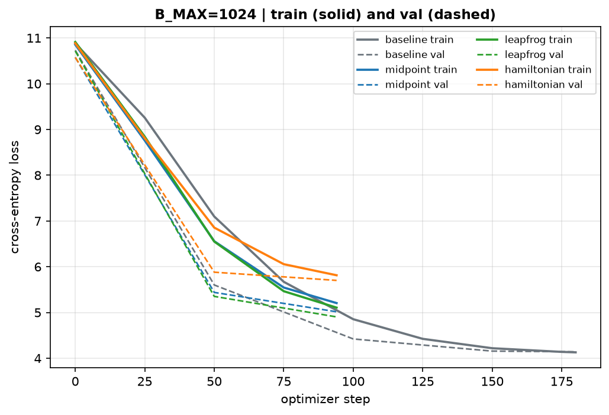
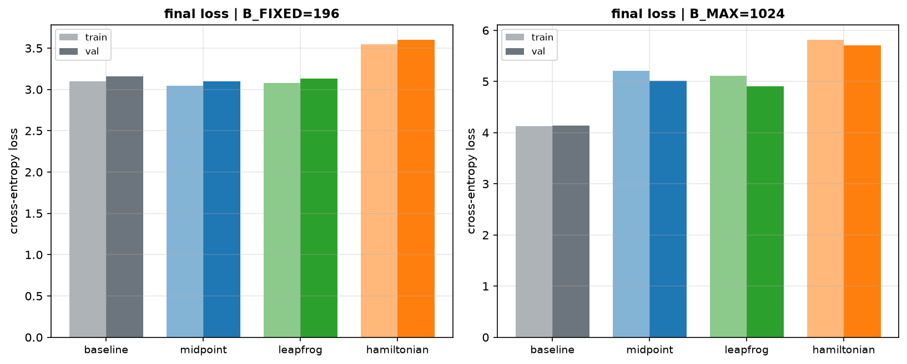
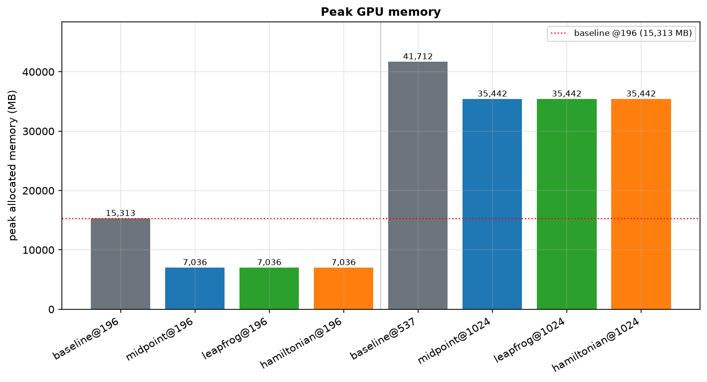
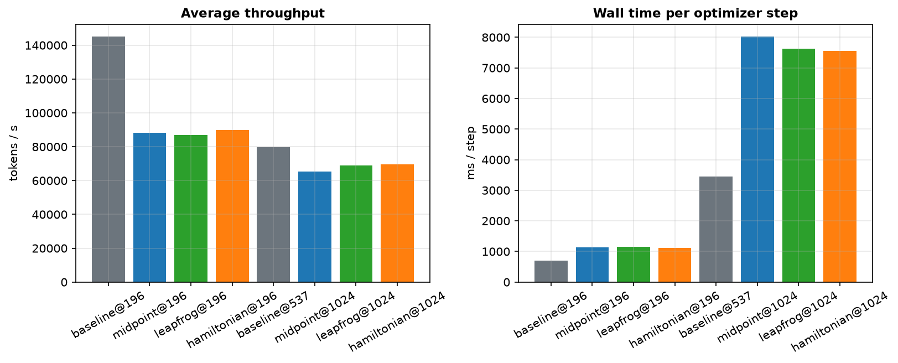
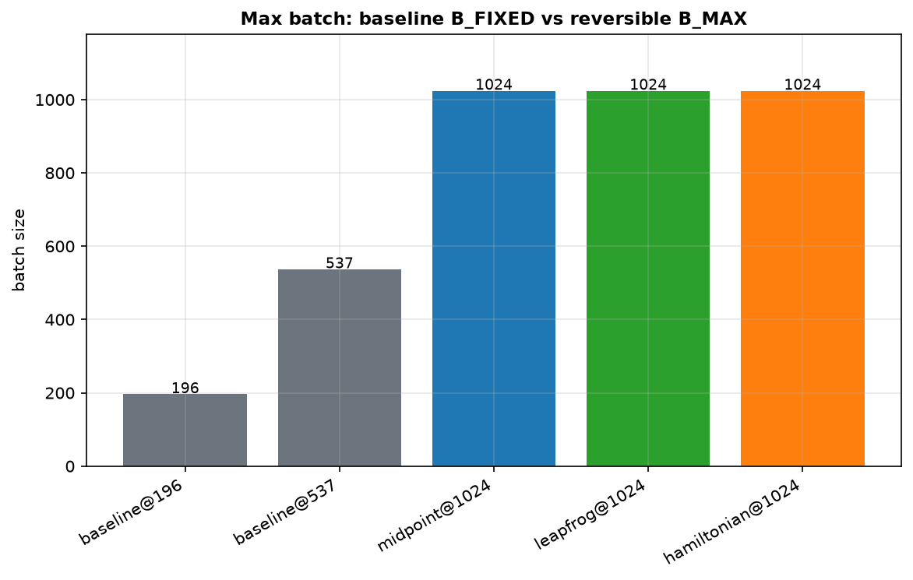
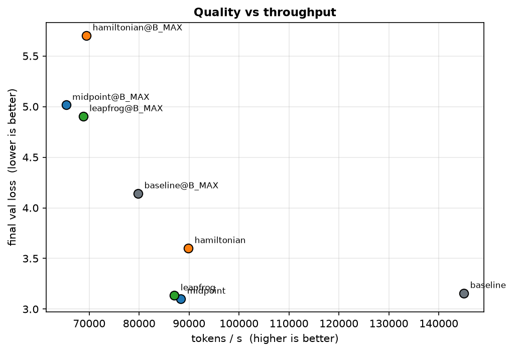

# Week 13 Assignment: Reversible LLM Training on a Single A100

**Hardware:** NVIDIA A100-SXM4-40GB (Colab-style runtime, CUDA 12.8, PyTorch 2.11.0+cu128)

## 1. Objective

The assignment defined three training tasks over one model architecture and one
token budget:

1. **Baseline.** Train a ~20M-parameter LLM for 50M tokens at a fixed, runnable
   batch size.
2. **Reversibility.** Train the same model again with a reversible (invertible)
   transformer stack, and report which discretization variant worked best
   (midpoint, leapfrog, or the Hamiltonian / symplectic-Euler form).
3. **Maximum batch.** Train the reversible model again at the maximum batch size,
   and report final loss, throughput (tokens/s), peak memory, and related
   findings.

The property under test is that an invertible stack removes the activation-memory
term from the backward pass, so larger batches should fit at equal device memory.

## 2. Background and Approach

The reversible integrators follow:

> Eshed Gal, Moshe Eliasof, Javier Turek, Uri Ascher, Eran Treister, Eldad Haber.
> **Reversing Large Language Models for Efficient Training and Fine-Tuning.**
> arXiv:2512.02056. https://arxiv.org/abs/2512.02056

A reversible layer is an invertible map between two states. Only the final state
pair is retained; intermediate states are recovered during the backward pass by
applying the analytic inverse layer-by-layer and recomputing the block, which
keeps activation memory constant in depth.

| Paper | Implementation |
|---|---|
| `f_θ(p) = Attn(LN1(p)) + MLP(LN2(p + Attn(LN1(p))))` (Eq 5) | `TransformerF` |
| Midpoint `p^{ℓ+1} = p^{ℓ-1} + 2h f(p^ℓ)` (Eq 4) | `02_midpoint.ipynb` |
| Leapfrog `p^{ℓ+1} = 2p^ℓ − p^{ℓ-1} + h² f(p^ℓ)` (Eq 6) | `03_leapfrog.ipynb` |
| Hamiltonian `q^ℓ = a q^{ℓ-1} + Attn(LN1(p^{ℓ-1}))`, `p^ℓ = b p^{ℓ-1} + MLP(LN2(q^ℓ))` (Eq 8-9, `a=b=1`) | `04_euler.ipynb` |

**Implemented scope.** This is a scaled-down reproduction at the assignment's
20M-parameter / 50M-token budget on TinyStories, not the paper's GPT-2
Small/Large on OpenWebText. The paper's *basic* discretizations (Eq 4/6/8-9) are
implemented. The paper's variable-coefficient "midpoint (a)" method (Eq 15-16),
its stability analysis (§3), and its retrofit/conversion pipeline (§4) are not
implemented.

## 3. Setup

### 3.1 Model

~20.11M parameters, nanoGPT-style, identical across variants.

| | |
|---|---|
| Layers `n_layer` | 9 |
| Heads `n_head` | 8 |
| Embedding `n_embd` | 256 |
| Block size | 512 |
| MLP ratio | 4× |
| Vocab | 50,257 (tied embeddings) |
| Dropout | 0.0 |
| Attention | `F.scaled_dot_product_attention` (causal) |

### 3.2 Data

- **TinyStories** (`roneneldan/TinyStories`), GPT-2 BPE tokenizer, `EOT = 50256`.
- 51,000,000 train tokens + 1,000,000 val tokens, stored as raw `uint16`
  (`data/train.bin`, `data/val.bin`).

### 3.3 Hardware and precision

| | |
|---|---|
| GPU | NVIDIA A100-SXM4-40GB (40,960 MiB) |
| Runtime | Colab-style CUDA, CUDA 12.8 |
| PyTorch | 2.11.0+cu128 |
| Precision | fp16 autocast + `GradScaler` (CUDA); MPS/CPU fall back to fp32 |

The notebooks auto-select `cuda → mps → cpu`, so they also run locally.

### 3.4 Training protocol

- `B_FIXED = 196`: a single fixed equal-batch anchor used by **all** notebooks
  (baseline included), so baseline vs reversible at equal batch is comparable.
- Token budget 50M; `total_steps = tokens // (B · T)` → 498 steps at B=196,
  181 at B=537, 95 at B=1024.
- AdamW, lr `6e-4`, cosine decay, warmup `min(1000, steps//10)`, weight decay
  `0.1`, betas `(0.9, 0.95)`, grad-clip `1.0`.
- Identical seed (`1337`) and schedule for every run.
- Validation uses a separate fixed RNG (`VAL_SEED`), so every evaluation sees the
  same validation windows and the curves are comparable across steps and runs.
- `final_train_loss` is an EMA over training steps (not a single noisy batch).
- Evaluation every 50 steps on a fixed ~4M-token budget (capped at 40 batches).
- `B_MAX` is found by a guarded binary-search probe; the probe **cap is 1024**, so
  a returned 1024 is a lower bound, not the true maximum.

## 4. Experiments

Each notebook is standalone: the first cell installs its dependencies and prints
the environment, and no result files are produced (only the session-local
`data/*.bin` token shards). All results are printed or rendered inline.

### 4.1 Experiment 1: Baseline (`01_baseline.ipynb`)

A non-reversible GPT is trained at `B_FIXED=196`, its own maximum batch is probed,
a second baseline run is trained at that maximum, and a
parameter / stack-activation / vocabulary-head memory breakdown is printed.

### 4.2 Experiment 2: Midpoint reversibility (`02_midpoint.ipynb`)

The reversible midpoint stack (Eq 4) is trained at `B_FIXED`, then probed and
trained at `B_MAX`. Invertibility, gradient parity, depth-wise activation memory,
and the memory breakdown are measured and printed.

### 4.3 Experiment 3: Leapfrog reversibility (`03_leapfrog.ipynb`)

As Experiment 2, using the leapfrog integrator (Eq 6).

### 4.4 Experiment 4: Hamiltonian / symplectic-Euler (`04_euler.ipynb`)

As Experiment 2, using the Hamiltonian split-step form (Eq 8-9). The file keeps
the "euler" label from the assignment list; the paper calls this the Hamiltonian
architecture.

## 5. Results and Discussion

### 5.1 Method: reversible stacks

Each layer is an invertible integrator step with `step` and an analytic `invert`.
The whole stack is wrapped in **one** `autograd.Function` (`ReversibleStack`) that
saves **only the final state pair**; the backward pass walks the layers in reverse,
recovers each layer's inputs by inversion, and recomputes the block with gradients
enabled, so parameter gradients remain exact in fp32 (the precision verified
below; the fp16 autocast path is not independently checked; see §7).

| Variant | Forward `step(prev, curr)` | Inverse `invert(prev_out, curr_out)` |
|---|---|---|
| midpoint | `prev' = curr`, `curr' = prev + 2h·f(curr)` | `prev_in = curr_out − 2h·f(prev_out)` |
| leapfrog | `prev' = curr`, `curr' = 2·curr − prev + h²·f(curr)` | `prev_in = 2·prev_out − curr_out + h²·f(prev_out)` |
| hamiltonian | `q' = q + Attn(LN1(p))`, `p' = p + MLP(LN2(q'))` | `p = p' − MLP(LN2(q'))`, `q = q' − Attn(LN1(p))` |

The Hamiltonian position state `q` starts at zero. Its stability condition is
`|ab| = 1`, `|a + b + αβ| ≤ 2` (Eq 24-25); with `a=b=1` this is easily violated
as the attention/MLP Jacobians grow, so it is expected to trail the other two.

**In-notebook sanity checks** (printed in every reversible notebook):

| Check | Result |
|---|---|
| Reversibility `max|recon − forward|` (fp32) | midpoint **1.59e-05**, leapfrog **5.0e-05**, hamiltonian **3.04e-06** |
| Gradient parity vs plain autograd, `max|Δgrad|` (fp32) | midpoint **3.0e-03**, leapfrog **6.0e-02**, hamiltonian **3.7e-03** |
| Same parity in **float64** (local run, **not reproduced in the notebooks**) | **~1e-12** for all three → the custom backward is mathematically exact; the fp32 gap is round-off amplified by the recurrence (grows with depth; leapfrog worst) plus nondeterministic FlashAttention backward |
| Activation memory vs depth (MB, `depth_memory_sweep`) | plain residual 189 → 248 (2→16 layers); `ReversibleStack` **flat at ~183** |
| Memory breakdown @B16,T128 (`memory_breakdown`) | reversible stack **248 MB** vs baseline stack **738 MB** |

> **Scope of these checks.** Reversibility and gradient parity are measured at
> `B=2, T=64`, in fp32, and **outside** `torch.autocast`. The training path runs
> under fp16 autocast, where the stack's forward stores fp16 states but the
> backward recompute runs in fp32 (no `torch.amp.custom_fwd`/`custom_bwd`); the
> fp32 checks therefore certify the fp32 gradients, not the autocast ones.

**Vocabulary-head memory.** The vocab head is expensive relative to a 20M-param
stack. It is held equal across all runs (`CE_CHUNKS = 8`) and computed **chunked
and `torch.utils.checkpoint`-ed**, so only one chunk is resident at a time and no
per-chunk activations accumulate. This removes the un-chunked-head floor (~30 GB)
and lets the equal-batch comparison isolate the reversible stack.

### 5.2 Main comparison: `B_FIXED = 196` (498 steps, ~50M tokens)

| Run | B | train (EMA) | val | tok/s | peak tok/s | peak MB | ms/step | wall s |
|---|---|---|---|---|---|---|---|---|
| baseline | 196 | 3.0995 | 3.1565 | 145,042 | 245,244 | **15,313** | 691.9 | 344.6 |
| **midpoint** | 196 | **3.0443** | **3.1011** | 88,346 | 117,786 | **7,036** | 1135.9 | 565.7 |
| leapfrog | 196 | 3.0762 | 3.1334 | 87,050 | 115,942 | **7,036** | 1152.8 | 574.1 |
| hamiltonian | 196 | 3.5482 | 3.6005 | 89,855 | 119,884 | **7,036** | 1116.8 | 556.2 |

Reversible peak is **7,036 MB vs 15,313 MB** → **−54.1%** at equal batch.

### 5.3 Maximum-batch runs

| Run | B | steps | train (EMA) | val | tok/s | peak tok/s | peak MB | ms/step | wall s |
|---|---|---|---|---|---|---|---|---|---|
| baseline@B_MAX | 537 | 181 | 4.1292 | 4.1415 | 79,783 | 109,112 | 41,712 | 3446.1 | 623.7 |
| midpoint@B_MAX | 1024 | 95 | 5.2058 | 5.0156 | 65,364 | 75,724 | 35,442 | 8021.1 | 762.0 |
| leapfrog@B_MAX | 1024 | 95 | 5.1063 | 4.9034 | 68,799 | 77,642 | 35,442 | 7620.6 | 724.0 |
| hamiltonian@B_MAX | 1024 | 95 | 5.8139 | 5.7013 | 69,438 | 77,036 | 35,442 | 7550.4 | 717.3 |

Reversible `B_MAX = 1024` vs baseline `B_MAX = 537` → **+90.7%** (1024 is a
probe-capped lower bound), and reversible @1024 (35,442 MB) uses **less** memory
than baseline @537 (41,712 MB).

> The `@B_MAX` runs use the same 50M-token budget but far fewer optimizer steps
> (181 and 95 vs 498), so their losses are **not** quality comparisons; they are
> memory/throughput datapoints.

### 5.4 Figures

**Loss at B_FIXED (train/val):**

**Loss vs tokens seen (step-count-fair view):**

**Loss at B_MAX:**

**Final loss / peak memory / throughput:**

**Max batch and quality-vs-throughput:**

### 5.5 What the results show

1. **Reversibility delivers a large activation-memory saving.** At `B_FIXED=196`
   the reversible stack uses **54.1% less peak GPU memory** (7,036 vs 15,313 MB).
   The saving is variant-independent (all three peak at exactly 7,036 MB), which
   is expected: the peak is the shared chunked head plus an O(1) stack.
2. **Reversibility buys a larger batch (measured to the probe cap).** Baseline
   tops out at 537; all reversible variants reach the probe cap of **1024**
   (≥1.9× baseline's stack-limited ceiling), at lower peak memory. This is a
   lower bound: at 1024 the runs used only ~35.4 GB of 40 GB.
3. **Midpoint is the best reversible variant** (val 3.1011 < baseline 3.1565);
   **leapfrog ties** the baseline (3.1334); the **Hamiltonian** split-step trails
   (3.6005), consistent with its marginal-stability condition and zero-initialized
   momentum. The paper includes the Hamiltonian variant only "for completeness".
4. **The price is recompute.** The reversible path is ~1.64× slower per token at
   equal batch (≈88k vs 145k tok/s), a **~64% time overhead, above the paper's
   stated 30-50%**; the paper's throughput gains assume a compute-bound/deep
   regime, whereas this 20M model is dominated by the (bandwidth-bound)
   vocabulary head.
5. **At the baseline's true maximum, throughput per token falls** (baseline @537:
   79,783 tok/s vs 145,042 @196) because the run sits at ~97% of VRAM
   (41.7 GB), where the allocator has little headroom. This is a memory-bound
   regime, not a compute one.

## 6. Problems Encountered and Resolutions

1. **A first reversible prototype was not O(1).** Wrapping each block in its own
   `autograd.Function` (each saving two states) left peak activation memory O(L)
   in depth, and the batch-size gain was marginal (~17%). The design was revised
   so that a single `Function` wraps the whole stack and saves only the final
   state pair, recovering per-layer inputs by inversion during backward.
   Activation memory then became flat in depth (§5.1).
2. **The Hamiltonian input gradient was initially incorrect.** Returning the sum
   of the position and momentum gradients (`gq + gp`) produced a large parity
   mismatch, because the position state `q` is initialized to zero and does not
   receive an input gradient. Returning `gp` (with an opt-in `q_from_x` flag for
   the `q = x` case) restored parity to ~1e-6.
3. **An unchunked vocabulary head imposed a ~30 GB floor.** Computing the head
   over the full sequence kept every chunk's log-softmax resident until one
   backward. Chunking the head and wrapping each chunk in a non-reentrant
   checkpoint removed the floor and made the equal-batch comparison meaningful.
4. **Validation windows were made deterministic.** A separate fixed `VAL_SEED`
   draws identical validation batches at every evaluation, so val curves are
   comparable across steps and runs instead of mixing data variance with
   optimization progress.

## 7. Limitations and Next Steps

- **Mixed precision vs. the custom backward.** Training runs under fp16
  `torch.autocast`. The stack's forward stores fp16 states and its backward
  recomputes in fp32 without `torch.amp.custom_fwd`/`custom_bwd`, so the fp32
  gradient-parity check does not by itself certify the autocast path.
- **Sanity-check shape.** Reversibility and gradient parity are measured at
  `B=2, T=64`, in fp32, outside autocast, not at the training shape (`T=512`)
  nor in the training precision.
- Single seed; the val differences between baseline/midpoint/leapfrog are small
  (0.023-0.055) and would benefit from multiple seeds.
- `h` was fixed at 1.0 (no sweep); the paper's variable-coefficient midpoint
  (Eq 15-16), its *primary* method, and its Eq 4-vs-15 ablation are not
  implemented. Only the basic midpoint (Eq 4) is reproduced.
- The paper's retrofit/conversion pipeline (§4) is out of scope.
- The float64 gradient-parity result (~1e-12) was obtained in a **local run and
  is not reproduced in the notebooks**; together with the fp32 gap it indicates
  the custom backward is mathematically exact, but the evidence is external.

## 8. Reproduction

1. Open each notebook on a Colab A100 (or run locally; it degrades to MPS/CPU).
2. Run cells top-to-bottom. `01_baseline` trains at `B_FIXED=196`, probes and
   reports its own max batch, then trains a second baseline run at that max;
   `02/03/04` train at `B_FIXED`, then auto-detect and train at `B_MAX`, and run
   reversibility / gradient-parity / depth-ablation / memory-breakdown.
3. To regenerate the combined figures: `python make_report_figures.py`
   (reads the executed notebook outputs; no re-training).

## 9. Appendix: Raw Run Summaries

Each notebook prints the full `summary` JSON for every run (`params_M`, batch,
`total_steps`, `final_train_loss` (EMA), `final_train_loss_last_batch`,
`final_val_loss`, `avg_tok_per_sec`, `peak_tok_per_sec`, `peak_mem_mb`,
`wall_time_s`, `time_per_step_ms`, `variant`, `h`, and `B_MAX` where applicable).
Those printed outputs are the source for the tables and for
`make_report_figures.py`.
